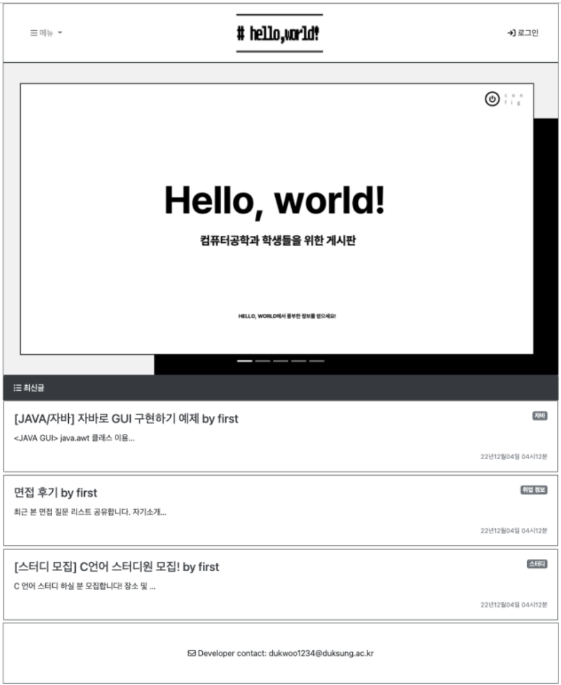
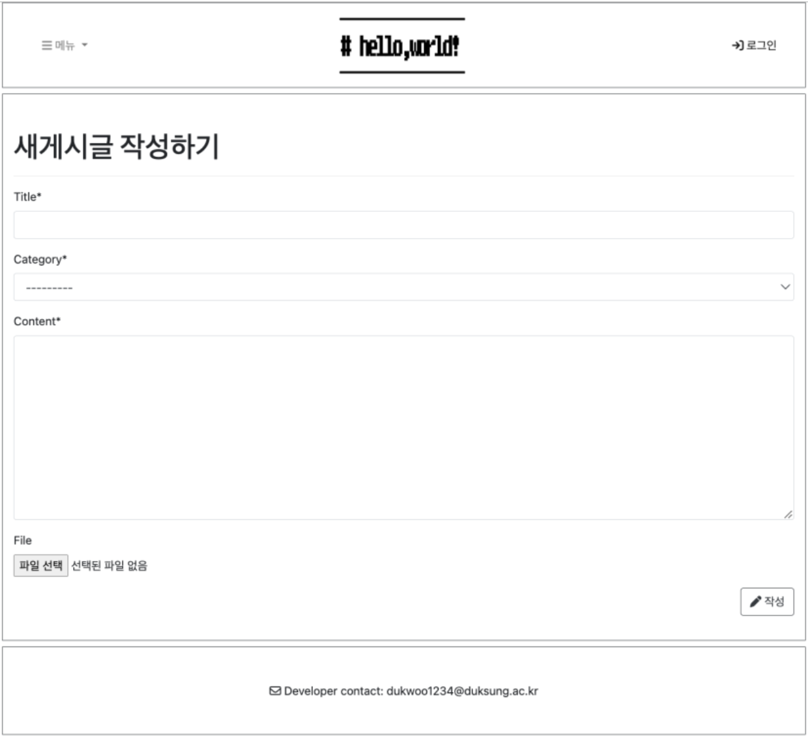
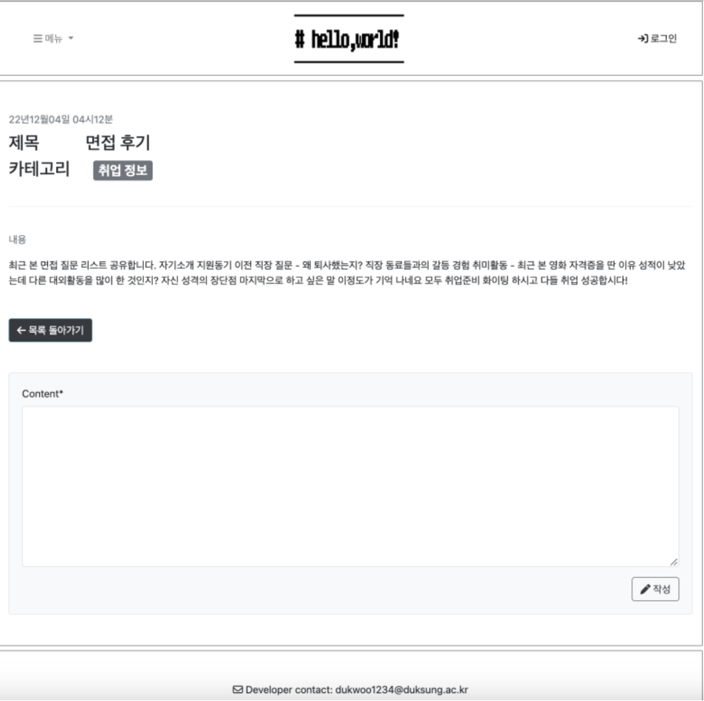
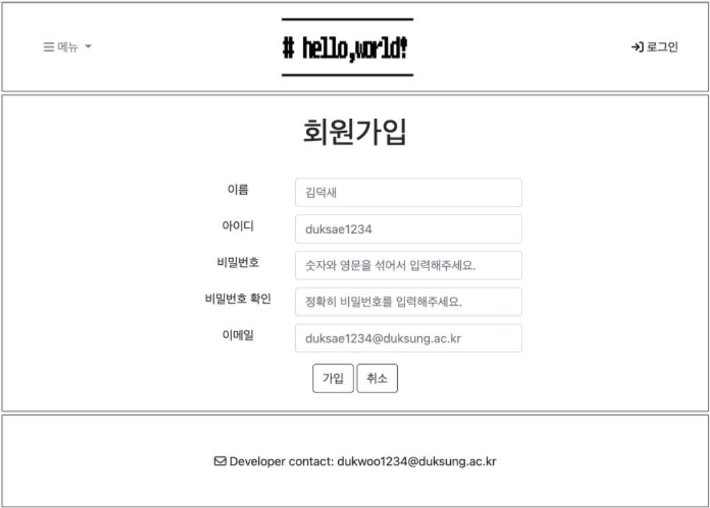
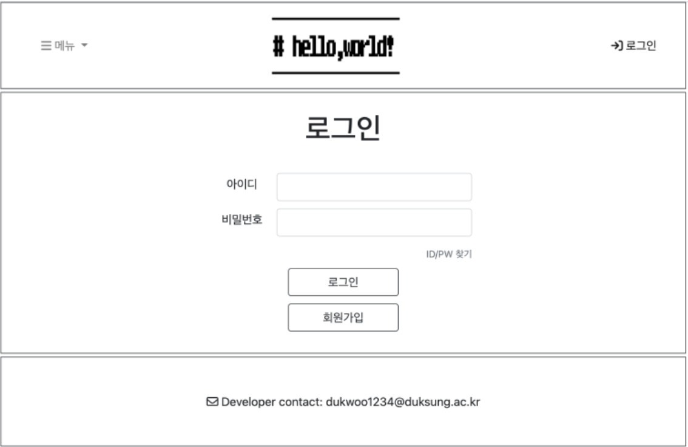
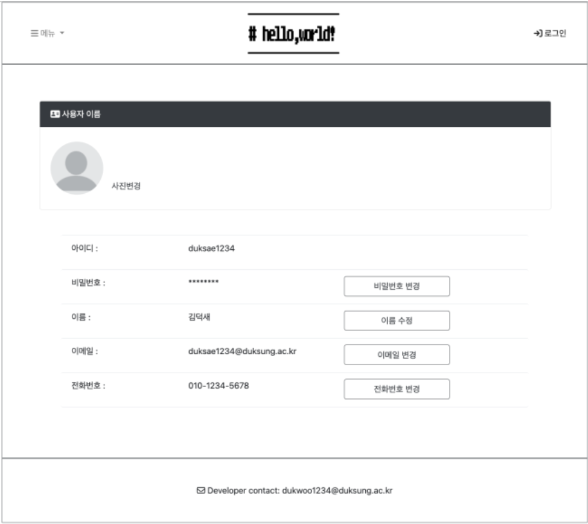
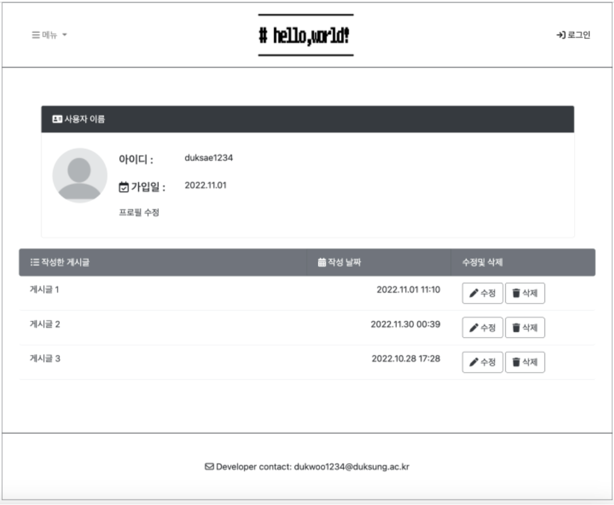

# 📁 HelloWorld! – Bulletin Board Web App for Computer Engineering Students

> A Django-based interactive platform for CE students to share class insights, code, and career tips — curated by Naomi Woo with major independent contributions.

 
 

## 🧩 1. Project Overview

**HelloWorld!** is a bulletin board-style web platform created to foster academic and career-driven exchange among computer engineering students. With a focus on peer-to-peer interaction, the site supports file sharing, code snippets, and job experience posts to enhance both learning and motivation.

Initially designed as a team project for a university course, Naomi took on a lead role and executed nearly all functional aspects independently — from backend architecture to frontend UI.

 

## 🔍 2. Background & Motivation

While many students rely on scattered resources during their CE studies, **HelloWorld!** aims to centralize key information in a dedicated community platform. It encourages knowledge-sharing across universities, and eventually aims to bridge the gap between current students, alumni, and professionals by:

- Promoting discussions on classes and code.
- Providing insights on competitions and career paths.
- Building a CE-exclusive ecosystem modeled after blog communities like Tistory (a popular Korean blogging site).

 

## ⚙️ 3. Tech Stack

| Category        | Tools & Frameworks                             |
|----------------|--------------------------------------------------|
| **Languages**   | Python 3.10, HTML5, CSS3, JavaScript            |
| **Frameworks**  | Django (MTV), Bootstrap                        |
| **Database**    | SQLite                                          |
| **Development** | VS Code, PyCharm                               |
| **Docs**        | Google Docs                                     |

 

## 💡 4. Core Features

- 📄 **Post Creation**: Write and share study notes or code insights  
- 📎 **File Attachment**: Upload reference materials or scripts  
- 💬 **Comments**: Engage in peer discussions under each post  
- 🗃 **Database Storage**: Persistent saving of posts and replies  
- 🙋‍♀️ **My Page**: Personalized dashboard for managing user content  

 

## 📸 Screenshots

Here’s a glimpse into the main features and interface of **HelloWorld!** — from user registration and login to posting, commenting, and profile management. The UI is kept minimal and intuitive for ease of use.

 
 

   
  <em>Main landing page</em>

 

   
  <em>Create a new post with file upload</em>

 

   
  <em>Comment section below a post</em>

 

   
  <em>User registration page</em>

 

   
  <em>Login page</em>

 

   
  <em>Profile editing screen</em>

 

   
  <em>User dashboard with post management</em>

 

 

## 🧑‍💻 6. My Role

Although this was a team project, I independently built and deployed most of the key features:
- Designed the database schema and implemented Django models
- Built dynamic views and user authentication features
- Styled the UI using Bootstrap, referencing Tistory layouts
- Managed Git versioning and wrote technical documentation

 

## 🚀 7. Future Vision

Plans for further development include:
- Adding real-time chat or discussion forums
- Expanding the target audience to include alumni and industry mentors
- Migrating to a scalable database such as PostgreSQL or MySQL
- Deploying to a public domain for live use

 

## 📫 Contact

Feel free to connect with me on [LinkedIn](https://www.linkedin.com/in/naominomads/) for any inquiries or collaborations.

